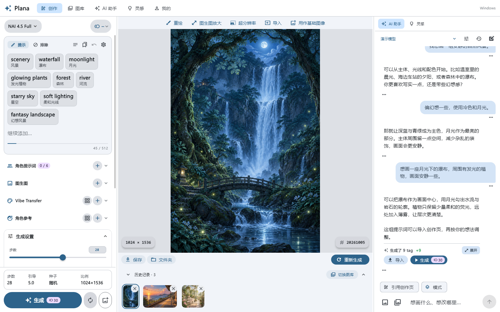
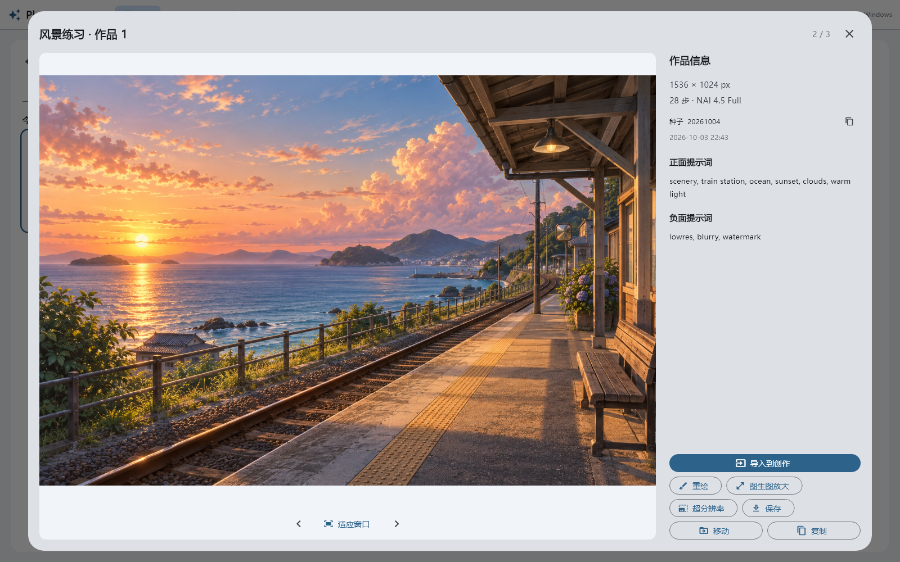
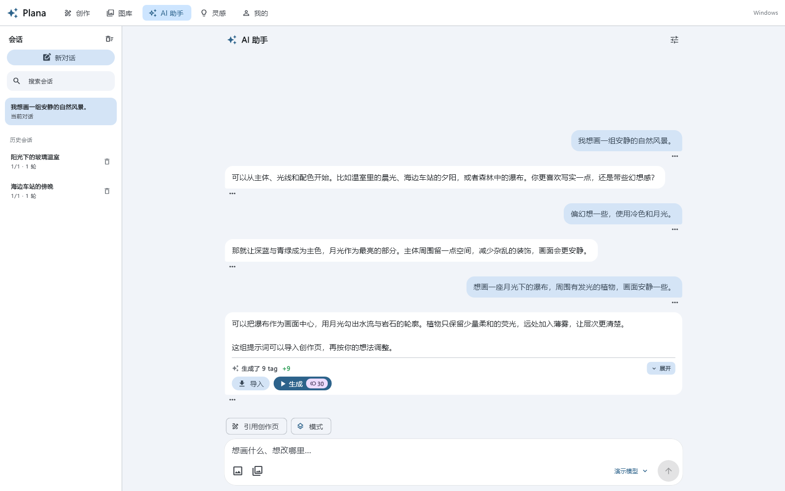

> macOS 测试移植版：基于 windows.45 桌面源码。构建与适配说明见 [docs/desktop-comparison.md](docs/desktop-comparison.md)。

# Plana App for Windows

**面向 Windows 的 AI 绘图工作台**

提示词、画布、图库与 AI 助手，在一个桌面窗口中完成。

[界面预览](#界面预览) · [桌面版亮点](#桌面版亮点) · [问题反馈](https://github.com/LingXia979/Plana-App-for-windows/issues) · [上游项目](https://github.com/mc5024/Plana-App)

## 项目状态

本项目基于 [Plana App](https://github.com/mc5024/Plana-App) 开发 Windows 桌面适配。
当前版本为 **1.1.1-windows.45（构建 64）**。本分支提供对应的 Windows 桌面源码，安装包与便携版见 [Releases](https://github.com/LingXia979/Plana-App-for-windows/releases/tag/v1.1.1-windows.45)。

- `Plana-app-for-windows`：Windows 桌面适配分支。
- [`plana-app-gallery-optimization`](https://github.com/LingXia979/Plana-App-for-windows/tree/plana-app-gallery-optimization)：图库优化分支。
- Android 原版介绍与下载请前往[上游仓库](https://github.com/mc5024/Plana-App)。

## 下载与安装

- [中文安装包（Windows x64）](https://github.com/LingXia979/Plana-App-for-windows/releases/download/v1.1.1-windows.45/Plana-Windows-1.1.1-windows.45-x64-setup.exe)：按中文向导选择安装目录，支持开始菜单、可选桌面快捷方式及卸载。
- [便携版 ZIP](https://github.com/LingXia979/Plana-App-for-windows/releases/download/v1.1.1-windows.45/Plana-Windows-1.1.1-windows.45-x64.zip)：完整解压后运行 `plana_app_for_windows.exe`。
- [SHA-256 校验清单](https://github.com/LingXia979/Plana-App-for-windows/releases/download/v1.1.1-windows.45/Plana-Windows-1.1.1-windows.45-x64-SHA256.txt)。

升级前请关闭旧版。作品自动保存到程序旁的 `output` 文件夹，卸载保留个人数据。发布包不附带个人账号、API/Bot/Web 授权、提示词草稿或私人 tag 库，首次使用请自行配置。当前安装包未进行代码签名。

开发与打包说明见 [Windows 使用说明](WINDOWS-README.md)。

## 界面预览

以下为 Windows 测试版的实际界面，使用隔离的示例图库与演示对话，不含个人作品、API 密钥或真实授权信息。

### 创作工作台

左侧编辑提示词与生成参数，中间查看画布与历史，右侧随时使用 AI 助手或灵感库。

### 图库与作品详情

按图库整理作品，结合日期、模型与收藏筛选；打开大图即可查看尺寸、种子和完整提示词。

### AI 助手

在独立页面中整理绘图想法、管理会话，将生成的提示词导入创作页；支持多图附件、历史选图和粘贴图片。侧栏与独立页面的生成图均可单击放大查看，支持缩放、拖动和 Esc 关闭。

## 桌面版亮点

以下功能对应上方展示的 Windows 测试版。

- **桌面工作台**：可调整侧栏宽度，提示词、画布与助手同屏；支持鼠标、键盘、文件拖入和快捷粘贴图片，图片按鼠标所在区域导入。
- **提示词与预设**：文本／标签视图切换，正负提示词折叠联动；快捷小窗查看与切换预设。
- **图库管理**：自建图库、日期筛选、收藏、多选与批量导出；一次复制到多个图库，每份副本独立保存。
- **AI 助手**：一次附加多张图片，从历史选择图片，拖入或粘贴到助手区域即可加入附件；支持会话管理、消息编辑及生成图原图预览。
- **参考与画布**：Vibe／角色参考单击立即切换、双击放大；图生图放大与超分辨率提供独立入口。
- **本地作品**：自动保存到程序根目录的 `output` 文件夹；创作历史、图库与生成参数可继续使用。

## 账号与使用

绘图需使用者自行配置 NovelAI 等相应服务；AI 助手需自行配置可用接口或相应服务授权。
测试包不附带开发者的 API 密钥、Web／Bot 授权、会话 Cookie 或个人图库。

## 反馈与上游

Windows 版的问题与建议请提交到[本仓库 Issues](https://github.com/LingXia979/Plana-App-for-windows/issues)，并注明版本、复现步骤及相关截图。

本项目保留上游的开源许可与第三方声明。原版功能、Android 构建说明及原作者维护的版本见 [mc5024/Plana-App](https://github.com/mc5024/Plana-App)。

## 致谢与出处

本项目站在这些工作之上。

### 数据与上游

| 来源 | 用途 |
|---|---|
| [Danbooru](https://danbooru.donmai.us/) | 标签体系与别名数据 |
| [Auto-NovelAI-Refactor](https://github.com/zhulinyv/Auto-NovelAI-Refactor) · zhulinyv | 离线补全词库(`assets/danbooru.tsv`,随包分发)的标签表、热度、类目与中文译名,取自其 `danbooru_tags_full_zh.csv`(GPL-3.0) |
| [DanbooruSearchOnline](https://github.com/SuzumiyaAkizuki/DanbooruSearchOnline) · SuzumiyaAkizuki | 增强补全的在线中文搜词、译名与一句话简介 |
| [quicktagcloud](https://novelai.quicktagcloud.com/) | 法典图鉴的全部数据(词条 / 画师串 / 合集 / 例图)。只读接入,数据不随包分发,本应用不修改也不发布法典内容,所有内容归原作者所有 |
| [@huggingface/tokenizers](https://github.com/huggingface/tokenizers) | T5 分词器移植的参照实现 |
| [anime_censor_detection](https://huggingface.co/deepghs/anime_censor_detection) · deepghs | 自动打码的检测模型(`assets/models/censor_n.ort`,随包分发),即其 `censor_detect_v1.0_n`,本项目只做了格式转换与量化(MIT) |
| [NovelAI](https://novelai.net/) · Anlatan | 图像生成服务本身 |

第三方内容的版权归其各自作者所有;其中随包分发的部分(标签库、T5 词表、打码模型)见
[THIRD_PARTY_NOTICES.md](THIRD_PARTY_NOTICES.md),其余仅作运行时索引与调用。

### 开源库

由 [Flutter](https://flutter.dev)(BSD-3-Clause,© The Flutter Authors)构建,并使用:

- **状态与界面** — [flutter_riverpod](https://pub.dev/packages/flutter_riverpod) ·
  [animations](https://pub.dev/packages/animations) ·
  [material_color_utilities](https://pub.dev/packages/material_color_utilities)
- **网络与编解码** — [http](https://pub.dev/packages/http) ·
  [archive](https://pub.dev/packages/archive) ·
  [msgpack_dart](https://pub.dev/packages/msgpack_dart) ·
  [image](https://pub.dev/packages/image) ·
  [crypto](https://pub.dev/packages/crypto) ·
  [cryptography](https://pub.dev/packages/cryptography)(Blake2b + Argon2id,账号密码登录靠它) ·
  [unorm_dart](https://pub.dev/packages/unorm_dart)
- **平台能力** — [flutter_secure_storage](https://pub.dev/packages/flutter_secure_storage) ·
  [photo_manager](https://pub.dev/packages/photo_manager) ·
  [photo_manager_image_provider](https://pub.dev/packages/photo_manager_image_provider) ·
  [path_provider](https://pub.dev/packages/path_provider) ·
  [gal](https://pub.dev/packages/gal) ·
  [file_picker](https://pub.dev/packages/file_picker) ·
  [url_launcher](https://pub.dev/packages/url_launcher) ·
  [share_plus](https://pub.dev/packages/share_plus)
- **构建期** — [flutter_lints](https://pub.dev/packages/flutter_lints) ·
  [flutter_launcher_icons](https://pub.dev/packages/flutter_launcher_icons)

以上均为宽松许可(BSD / MIT / Apache-2.0),逐包清单见
[THIRD_PARTY_NOTICES.md](THIRD_PARTY_NOTICES.md);应用内「关于 → 开源许可」亦有完整入口。

## 许可

Copyright (C) 2026 Sora_Light

本项目以 GPL-3.0 发布,全文见 [LICENSE](LICENSE)。分发修改版(含打包为安装包或便携包分发)
须同样以 GPL-3.0 开源;本程序不作任何担保。

第三方内容不在本许可范围内,版权归各自作者所有,详见
[THIRD_PARTY_NOTICES.md](THIRD_PARTY_NOTICES.md)。

## 免责声明

本项目为非官方的第三方客户端,与 NovelAI (Anlatan) 无关联。用户需自行遵守
NovelAI 的服务条款。因使用本应用导致的账号问题、内容问题及任何其他后果,
均由用户自行承担。
